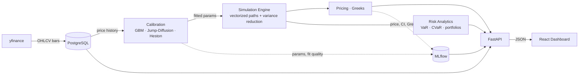

# Monte Carlo Options Pricing System

An end-to-end derivatives pricing stack: it pulls real market history, fits
three stochastic price models to it, simulates forward paths, prices exotic
options off those paths with Greeks and confidence intervals, and runs
portfolio risk analytics — all behind a FastAPI service with a React dashboard
and MLflow experiment tracking. The whole thing comes up with one command.

The design line that runs through it: the quantitative core
(`calibration`, `simulation`, `pricing`, `risk`) is pure NumPy/SciPy with no
I/O, no database, and no MLflow. Only the API layer touches the outside world.
That is what makes the engine testable — 491 tests, most of them convergence
and invariant checks rather than fixtures.

## Architecture



Data flows left to right; MLflow is a side-channel that every calibration and
pricing run logs to, and that the dashboard reads back for the run history.

## Quickstart

Prerequisites: Docker and Docker Compose. Nothing else — no local Python, no
Node.

```bash
git clone <repo-url> monte-carlo-pricer
cd monte-carlo-pricer
cp .env.example .env
docker-compose up --build
```

The first run seeds the database with three years of daily history for AAPL,
GOOGL and MSFT (about 30 seconds of yfinance calls). Subsequent starts see the
data already there and skip straight to serving.

| Service | URL |
| --- | --- |
| Dashboard | http://localhost:3000 |
| API docs (Swagger) | http://localhost:8000/docs |
| MLflow UI | http://localhost:5000 |

The dashboard calls the API at the relative path `/api`, which Nginx proxies
to the backend container — so the browser only ever talks to one origin, and
no API hostname is baked into the JavaScript bundle at build time.

## Local development (without Docker)

**Backend.** Needs Python 3.12 and a reachable Postgres.

```bash
pip install -r requirements.txt
docker compose up -d postgres mlflow    # or bring your own Postgres
cp .env.example .env                    # then edit DB_* to match
python -c "from src.data.storage import create_tables; create_tables()"
python -m src.seed                      # optional: fetch AAPL/GOOGL/MSFT
uvicorn src.api.main:app --reload
```

`.env` drives everything through `src/config.py` (`DB_HOST`, `DB_PORT`,
`DB_NAME`, `DB_USER`, `DB_PASSWORD`, `MLFLOW_TRACKING_URI`). Compose overrides
the host and port for the containerised backend, so the same `.env` works for
both.

**Frontend.**

```bash
cd frontend
cp .env.example .env    # VITE_API_BASE_URL=http://localhost:8000
npm install
npm run dev
```

The Vite dev server has no proxy in front of it, so `frontend/.env` points the
axios client straight at the backend; CORS on the API allows it. Without that
variable the client falls back to `/api`, which is what the Docker build uses.

## Tech stack

| Layer | Choice | Why |
| --- | --- | --- |
| Numerics | NumPy, SciPy | Fully vectorized paths; SciPy for optimizers and distributions |
| API | FastAPI, Pydantic, Uvicorn | Typed request/response contracts, generated OpenAPI docs |
| Frontend | React 19, Vite, Recharts, Tailwind v4 | Hooks and one context — no state library needed at this size |
| Storage | PostgreSQL 16, SQLAlchemy Core | Upsert-on-conflict ingestion; Core rather than ORM, as this is a query layer not a domain model |
| Tracking | MLflow | Calibration and pricing runs logged with params and metrics |
| Packaging | Docker, Docker Compose, Nginx | Four services, one command; multi-stage frontend build |

## Models

All three are calibrated from historical log-returns and simulated under the
same convention: **`mu` is the price-level drift**, so `E[S_T] = S_0 e^{mu T}`
for every model. Each simulator re-subtracts its own Itô and jump-compensator
terms internally.

**Geometric Brownian Motion** — the baseline. Closed-form exact stepping, no
discretization error.

```
dS_t = mu S_t dt + sigma S_t dW_t
S_t  = S_0 exp((mu - sigma^2/2) t + sigma W_t)
```

Calibrated by moment-matching log-returns: `sigma = std(r)/sqrt(dt)`,
`mu = mean(r)/dt + sigma^2/2`.

**Merton Jump-Diffusion** — GBM plus a compensated Poisson jump component,
which produces the fat tails and negative skew that GBM cannot.

```
dS_t/S_t = (mu - lambda k) dt + sigma dW_t + (J - 1) dN_t
N_t ~ Poisson(lambda t),  ln J ~ N(mu_J, sigma_J^2),  k = E[J-1]
```

Fitted by maximum likelihood over the Poisson-mixture density. The
`-lambda k` compensator is what keeps `mu` the total expected return.

**Heston** — stochastic volatility, with variance following a mean-reverting
CIR process correlated with the price.

```
dS_t = mu S_t dt + sqrt(v_t) S_t dW_t^S
dv_t = kappa (theta - v_t) dt + xi sqrt(v_t) dW_t^v,   d<W^S, W^v> = rho dt
```

Fitted by least squares against the realized-volatility term structure —
rolling volatility at several horizons, which is what pins down `kappa` and
`theta` from returns alone. Simulated with Andersen's Quadratic-Exponential
scheme rather than Euler,
because the calibrator is allowed to return parameters that violate the Feller
condition (`2 kappa theta > xi^2`) — exactly the regime where Euler drives the
variance negative. QE stays non-negative by construction.

Pricing runs the same simulators with `mu` overridden by `r - q`, which is the
only difference between the physical and risk-neutral measures here. Greeks
come from bump-and-revalue on common random numbers, so the differencing noise
cancels rather than swamping the estimate.

## API endpoints

| Method | Path | Description |
| --- | --- | --- |
| `GET` | `/health` | Liveness check |
| `GET` | `/data/tickers` | Tickers in storage, with date ranges and row counts |
| `GET` | `/data/{ticker}` | Stored OHLCV bars, optionally date-bounded |
| `POST` | `/calibrate` | Fit GBM / jump-diffusion / Heston to stored prices |
| `POST` | `/simulate` | Path fan chart under the **physical** measure |
| `POST` | `/price-option` | Monte Carlo price, CI and Greeks under the **risk-neutral** measure |
| `POST` | `/risk/metrics` | Single-asset VaR, CVaR, max drawdown, Sharpe |
| `POST` | `/risk/portfolio` | Correlated multi-asset risk, optionally stressed |
| `GET` | `/risk/scenarios` | Preset stress scenarios |
| `GET` | `/mlflow/experiments` | Experiments logged to the tracking server |

Full request/response schemas at `/docs`. Two contract details worth knowing:
VaR and CVaR come back as raw P&L quantiles, so **a loss is negative**; and
requests above 100,000 paths are refused with `413` rather than attempted.
Behind Nginx every path above is prefixed with `/api`.

## Project structure

```
src/
  config.py            Pydantic Settings, env-driven
  seed.py              First-run market data seed (idempotent, best-effort)
  data/                yfinance fetcher, Postgres storage, row schemas
  calibration/         GBM, Merton jump-diffusion, Heston fitting
  simulation/          Path engines + variance reduction (antithetic, stratified)
  pricing/             MC pricer, payoff registry, Black-Scholes, Greeks
  risk/                VaR/CVaR, correlated portfolios, stress scenarios
  api/                 FastAPI app, routers, schemas
frontend/src/
  api/client.js        axios client + error unwrapping
  pages/               Calibrate · Simulate & Price · Risk · Runs
  components/          Charts, tables, inputs
  hooks/, context/     Fitted params flow between tabs via one context
tests/                 491 tests
docker-compose.yml     postgres · mlflow · backend · frontend
Dockerfile             Backend image; entrypoint seeds, then serves
entrypoint.sh
frontend/Dockerfile    Multi-stage: Vite build → Nginx
frontend/nginx.conf    Static assets, /api proxy, SPA fallback
```

## Testing

From the project root, with Postgres reachable via `.env`:

```bash
pytest
```

491 tests across calibration, simulation, pricing, risk, storage and the API —
including convergence tests against Black-Scholes closed forms, martingale
checks on every simulator, and round-trip recovery of known parameters by each
calibrator. Four are marked `network` and make real yfinance calls; the other
487 run offline:

```bash
pytest -m "not network"
```

## Future work

- **Scheduled data refresh** — an APScheduler job (or a cron sidecar) doing a
  nightly incremental fetch; the fetcher is already append-only, so this is
  wiring rather than logic.
- **Export from the dashboard** — CSV of simulated paths and metrics, PNG of
  the charts.
- **Convergence analysis page** — standard error against path count, per
  variance-reduction technique, to make the estimator's cost/accuracy tradeoff
  visible.
- **GPU acceleration** — the simulators are pure array ops on a single
  namespace, so a CuPy backend is largely a matter of swapping the module.
- **Heston calibration from the options chain** — fit to implied vol surfaces
  instead of historical returns. Chain data is already fetched and stored
  (`fetch_options_chain`, `options_chain` table); the objective function is
  the missing piece.
